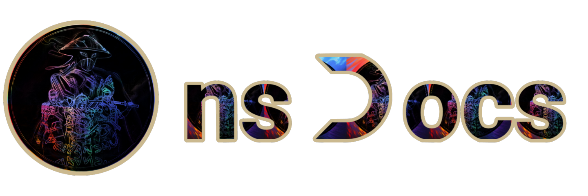

# nsDocs

## About

A production level discord app guide! also this guide provides comprehensive instructions for creating a production-level Discord app using TypeScript.

## Features

- **Based on `discord.js`**: Utilize the robust and widely-used [discord.js](https://discord.js.org/) library to power your Discord bot.

- **Tailored for TypeScript**: Designed specifically for TypeScript, ensuring type safety and a better development experience.

- **Complete Journey**: Covers everything from initial setup to advanced features, ensuring you have all the knowledge you need.

- **Modern UI**: Built with `Next.js` and `Nextra`, providing a sleek, responsive, and user-friendly interface.

- **Step-by-Step Instructions**: Detailed steps and explanations to help you go from beginner to advanced levels and to help you understand each concept clearly.

- **Open Source**: Contribute and improve to expand the guide as it is open to the community.

## Technology Used

- [Next.js](https://nextjs.org/) Next.js is a React framework that enables several powerful features, including server-side rendering and static site generation.
- [Nextra](https://nextra.vercel.app/) Nextra is a Next.js-based static site generator that makes it easy to create and manage documentation websites.

## Support

If you need assistance with understanding the documentation, encounter any issues, or simply require guidance, please join our [Discord server](https://discord.com/invite/RmDczqhBn6). Our community and support team are here to help you!

## Contributors

